<div align="center">

<!-- Animated header banner -->


<!-- Visitor badge + social links -->
<p>
  
  &nbsp;
  <a href="https://github.com/Jon-Ting?tab=followers">
    
  </a>
  &nbsp;
  <a href="https://github.com/Jon-Ting?tab=stars">
    
  </a>
  <a href="https://github.com/sponsors/Jon-Ting">
    
  </a>
</p>

</div>

---

## 🌊 About Me

```python
class Jon-Ting:
    location   = "🌏 Australia"
    interests  = ["Computational Science", "Data Analysis", "Open Source"]
```

---

## 📊 GitHub Stats

<!-- Stats and Languages are generated by the GitHub Action in .github/workflows/metrics.yml
     They will appear here once the workflow runs for the first time. -->

<table width="100%">
  <tr>
    <td width="51%" align="center" valign="top">
      
    </td>
    <td width="49%" align="center" valign="top">
      
      
    </td>
  </tr>
</table>

---

## 🏆 Trophy Cabinet

<div align="center">


</div>

---

## 📈 Contribution Activity

<div align="center">


</div>

---

<div align="center">

<!-- Footer wave -->


<sub>Crafted with 💙 · Stats auto-updated daily via <a href="https://github.com/lowlighter/metrics">lowlighter/metrics</a> GitHub Action</sub>

</div>
